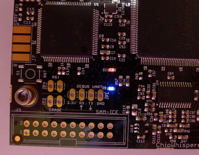

# Red and Blue light Problem!!!

While doing something, if you unexpectedly see this blue and red light being on the board, Do not panic, it is just there is no firmware in the scope and it is ready to be flashed with new firmware.

In that case, just do this 



image source: [new wiki website](https://wiki.newae.com/Manual_SAM3U_Firmware_Update)

```python

import chipwhisperer as cw

PLATFORM = "cwlite"
cw.program_sam_firmware(hardware_type=PLATFORM)

```

the output will be something like

```text
Found /dev/ttyUSB0
Loading cwlite firmware...
Opened!
Connecting...
Connected!
Erasing...
Erased!
Programming file cwlite/mcufw.bin...
```