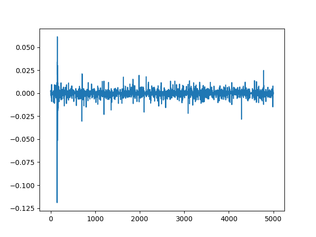

## Lab 3_1 : Large Hamming Weight Swings 

In the previous lab, we have seen how different instructions result in different power consumption traces. We might have thought that, OK! since the instructions are following different paths based on the data, this is possible, or else this might not be. Yes, that is a good intuition. But it is also possible to differentiate the traces based on the data being computed. This will be shown in this lab.

In this lab, we use the `tinyaes` algorithm,  which can be found in `chipwhisperer/firmware/mcu/crypto/` folder.

```python
SCOPETYPE = 'OPENADC'
PLATFORM = 'CW308_STM32F4'
CRYPTO_TARGET = 'TINYAES128C'
SS_VER = 'SS_VER_2_1'

%run "../../Setup_Scripts/Setup_Generic.ipynb"
```
<!-- 
```python

``` -->

```python
%%bash -s "$PLATFORM" "$CRYPTO_TARGET" "$SS_VER"
cd ../../../firmware/mcu/simpleserial-aes
make PLATFORM=$1 CRYPTO_TARGET=$2 SS_VER=$3 -j
```


```python
cw.program_target(scope, prog, "../../../firmware/mcu/simpleserial-aes/simpleserial-aes-{}.hex".format(PLATFORM))

```
Now, we collect some traces, such that, the plain text contains value at one of byte index as either `0x00` or `0xFF`.

```python
from tqdm.notebook import trange
import numpy as np
import time

ktp = cw.ktp.Basic()
trace_array = []
textin_array = []

key, text = ktp.next()

target.set_key(key)
print("key used =" , key)

byte = 2

N = 100
for i in trange(N, desc='Capturing traces'):
    scope.arm()
    if text[byte] & 0x01:
        text[byte] = 0xFF
    else:
        text[byte] = 0x00
    target.simpleserial_write('p', text)
    
    ret = scope.capture()
    if ret:
        print("Target timed out!")
        continue
    
    response = target.simpleserial_read('r', 16)
    
    trace_array.append(scope.get_last_trace())
    textin_array.append(text)
    print('text=',text)
    #print(response)
    
    key, text = ktp.next() 
```


Now, we group them into two groups `0x00` group and `0xFF` group

```python
one_list = []
zero_list = []
for i in range(len(trace_array)):
    if textin_array[i][byte] == 0x00:
        zero_list.append(trace_array[i])
        print("This should be added to 0 list")
    else:
        one_list.append(trace_array[i])
        print("This should be added to 1 list")
```

Now, we average the traces at the points in each group. That is, for a given group, we calculate the mean of the power trace value at a given point. This can be accomplished using,

```python
import numpy as np
trace_length = len(one_list[0])
print("Traces had original sample length of %d"%trace_length)

one_array = np.array(one_list)
one_avg = np.mean(one_array, axis=0)
one_avg = one_avg.tolist()

zero_array = np.array(zero_list)
zero_avg = np.mean(zero_array, axis=0)
zero_avg = zero_avg.tolist()
```

Finally subtract the arrays and plot them
```python
plot = []
for i in range(len(trace_array[0])):
    plot.append((one_avg[i]-zero_avg[i])*(+1))
    
cw.plot(plot)
```



You should see a very distinct trace near the beginning of the plot, meaning that the data being manipulated in the target device is visible in its power trace! Again, there's a lot of room to explore here:

- Try setting multiple bytes to 0x00 and 0xFF.
- Try using smaller hamming weight differences. Is the spike still distinct? What about if you capture more traces?
- We focused on the first byte here. Try putting the difference plots for multiple different bytes on the same plot.
- The target is running AES here. Can you get the spikes to appear in different places if you set a byte in a later round of AES (say round 5) to 0x00 or 0xFF?
