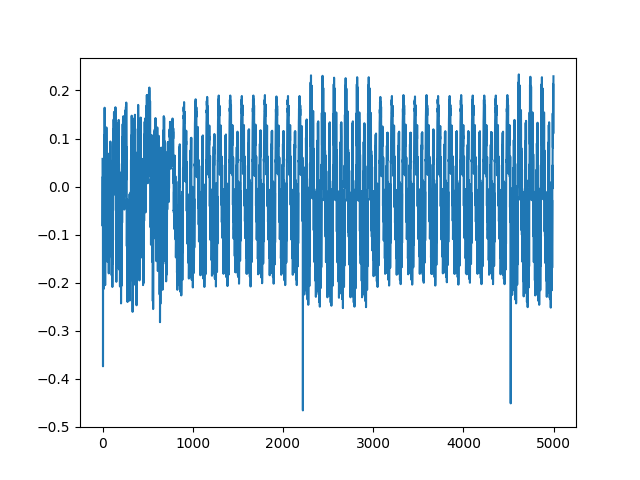
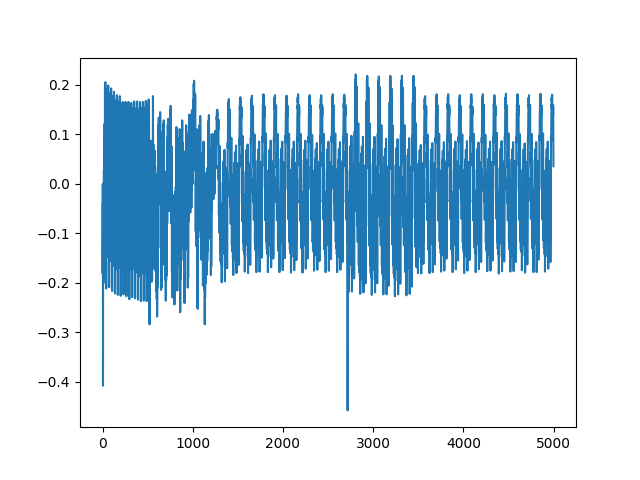

## Lab 1
This lab helps you with the following

- Setting up your ChipWhisperer Hardware
- Using the ChipWhisperer Python API to connect to your hardware
- Communication with the target
- Capturing a power trace

### PLATFORM

For the tutorials the platform names are as follows:
- Husky: `PLATFORM='CWHUSKY'`
- Nano: `PLATFORM='CWNANO'`
- UFO Board: `PLATFORM='CW308_STM32F3'`
- Lite:
    - STM32F3 Target: `PLATFORM='CWLITEARM'`
    - XMEGA target: `PLATFORM='CWLITEXMEGA'`
    - Two part version: `PLATFORM='CWLITEXMEGA'`

### Connecting to ChipWhisperer

First of all, we connect to the scope. This can be done by using the scope API which can be done using 
```python
import chipwhisperer as cw
scope = cw.scope()
```
this will connect to a ChipWhisperer device and return a scope object of the correct type. We can set the parameters of scope through this object.

scope has these parameters by the way.

cwlite Device|
sn         = 50203220594a48303330303238303031 
| fw_version | gain              | adc                                  | clock                     | trigger          | io                                                  | glitch            |
|:-----------|:------------------|:-------------------------------------|:--------------------------|:-----------------|:----------------                                    |:------------------|
| major=0    | mode=low          | state=False                          | adc_src=clkgen_x1         | triggers=tio4    | tio1=serial_tx                                      | clk_src=target    |
| minor=65   | gain=0            | basic_mode=low                       | adc_phase=0               | module=basic     | tio2=serial_rx  | mmcm_locked=False |
| debug=0    | db=5.5            | timeout=2                            | adc_freq=96000000         |                  | tio3=high_z     | width=10.15625    |
|            |                   | offset=0                             | adc_rate=96000000.0       |                  | tio4=high_z     | width_fine=0      |
|            |                   | presamples=0                         | adc_locked=True           |                  | pdid=high_z     | offset=10.15625   |
|            |                   | samples=24400                        | freq_ctr=0                |                  | pdic=high_z     | offset_fine=0     |
|            |                   | decimate=1                           | freq_ctr_src=extclk       |                  | [nrst](../lab2_1a/lab2_1a.md#scopeionrst)=high_z     | trigger_src=manual|
|            |                   | trig_count=1137825499                | clkgen_src=system         |                  | glitch_hp=False | arm_timing=after_scope |
|            |                   | fifo_fill_mode=normal                | extclk_freq=10000000      |                  | glitch_lp=False | ext_offset=0      |
|            |                   |                                     | clkgen_mul=2              |                  | extclk_src=hs1  | repeat=1          |
|            |                   |                                     | clkgen_div=1              |                  | hs2=None        | output=clock_xor  |
|            |                   |                                     | clkgen_freq=192000000.0   |                  | target_pwr=True |                   |
|            |                   |                                     | clkgen_locked=True        |                  | tio_states=(1,1,0,0) |                |
|            |                   |                                     |                           |                  | cdc_settings=[1,0,0,0] |              |


If all goes right, a green light (4th from the top) should start blinking.

Now that we have connected with the scope and have got an object, we will connect to the target device. For that, we use,

```python
import chipwhisperer as cw
scope = cw.scope()
target = cw.target(scope, cw.targets.SimpleSerial)

```

The target object provides the interface for configuring the target device under test (DUT). There are currently two UART communication classes:

1. Simple Serial target
2. Simple Serial V2 target

and by the way there are two FPGA based targets also:

1. CW305 FPGA Target
2. CW310

check this class `class chipwhisperer.targets.SimpleSerial` for the methods etc. This file is usually located at `ChipWhisperer\chipwhisperer\software\chipwhisperer\capture\targets`

```python
scope.default_setup()
```
This sets some sane defaults on to the scope. (like the defualts)

Now, we build the firmware that we are going to flash into the target. To flash a custom firmware, there is a detailed procedure, but for now, know that each of the firmware has its own directory and a source c file. This folder also consists of a make file that includes the master make files such as  `firmware/mcu/simpleserial/Makefile.simpleserial` and `firmware/mcu/Makefile.inc`

To build the firmware specifically for that device, we use (for example)
```bash
make PLATFORM='CW308_STM32F3' CRYPTO_TARGET=NONE
```
This builds the necassary firmware. Now to flash this firmware, we use this command (assuming the path to the firmware is as mentioned).

```bash
cw.program_target(scope, cw.programmers.STM32FProgrammer, "../firmware/mcu/simpleserial-base/simpleserial-base-CW308_STM32F3.hex")
```
Usually, we have to flash the firmware into the micro controllers using some sort of tool chains, but chipwhisperer has provided support for `XMEGA`, `STM32F*`, `AVR`, and `SAM4S` bootloaders


### Communicating With The Target

Ultimately, the target is a microcontroller and is a serial device. We can use pyserial to communicate with the target. However, chipwhisperer has made some useful APIs to communicate with the target device.


To communicate with the target, we use the target object (that we have obtained using the `cw.target(..)` command), there are two categories of communicating and those are
1. Raw serial via `target.read()`, `target.write()`, `target.flush()`, etc.
2. SimpleSerial commands via `target.simpleserial_read()`, `target.simpleserial_write()`, `target.simpleserial_wait_ack()`, etc.


First we will look at the SimpleSerial commands.
As we can see in the `simpleserial-base.c` file, we can see that we have defined two functions namely 
`get_key` and `get_pt` and said to the mcu that if 'p' is sent, then execute `get-pt` and execute `get-key` when 'k' is sent. In the end, we have `simpleserial_get()`, that just looks for the commands and executes them based on the request sent.

so the basic functionality will be like

```python
msg = bytearray([0]*16) #simpleserial uses bytearrays
target.simpleserial_write('p', msg) #sends msg with command 'p'. i.e. it executes get_pt
print(target.simpleserial_read('r', 16))# prints whatever is read from that mcu (16 Bytes are read)
target.simpleserial_write('k', msg)#sends msg with command 'k'. i.e. it executes get_key
print(target.simpleserial_wait_ack()) #should return 0 because that is what get_key does.
```


In order to use the Raw serial communication, the flow is in this way

```python
target.write('p' + '000102030405060708090a0b0c0d0e0f' +'\n'  )
print(target.read())
```


### Capturing Traces
Now that we have understood how the communication works, lets focus onto capturing the power Traces.
Important functions that we need to know to capture traces are

In firmware, `trigger_high()` and `trigger_low()` are placed between the code that we want to capture the power traces from.

In the Jupyter (or while implementing in python)
- `scope.arm()`: This will tell the scope object to begin capturing as soon as it is triggered (which in our case is a rising edge on gpio4).
- `scope.capture()` : will read back the captured power trace, blocking until either ChipWhisperer is done recording, or the scope times out. **Note that the error return will tell you whether or not the scope timed out. It does not return the captured scope data.** That means, if the output of this is `false`, then it is actually completed without any errors.
- `scope.get_last_trace()`: gives us the actual collected trace.

To test how captured powers differ, try to change the get_pt function with 

```c
pt[0] = pt[0]+1;

```

and 

```c
for(int t = 0 ; t<16; t++ ){
        pt[t] = pt[t] + 1;
    }
```

in the code between the `trigger_high()` and `trigger_low()` calls.

like for example here is how the one with just addition looks like



and this is how the one with for loop looks like




And finally do not forget to disconnect the scope and target. This is required for us to be able to use it again.
```python
scope.dis()
target.dis()
``` 
That is it. We have known the required tools of the procedure to be able to continue to the next tutorials.


