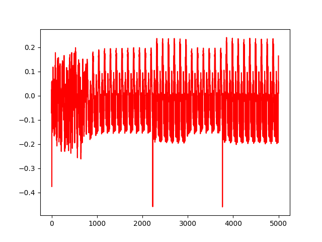
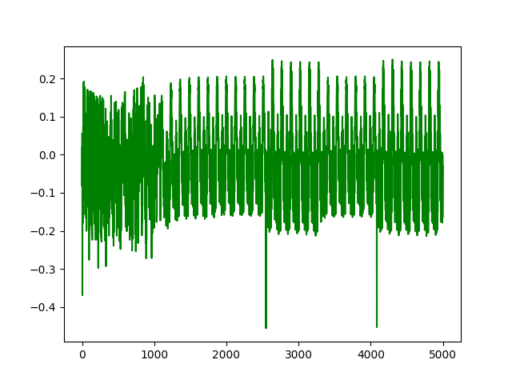
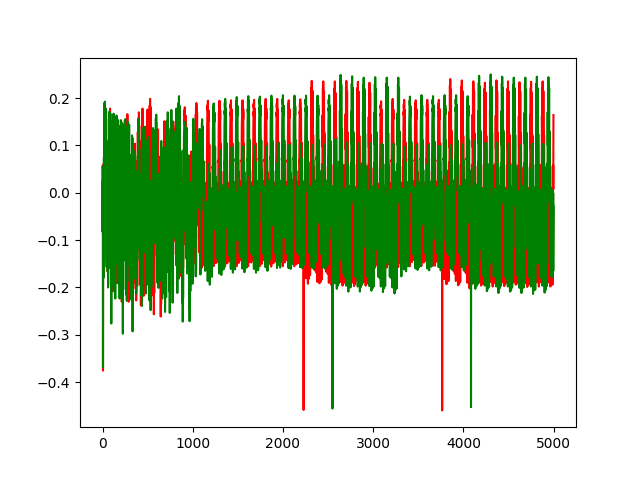
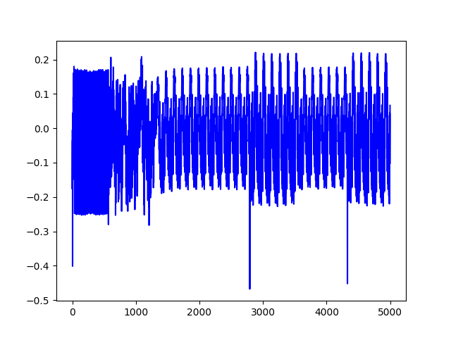
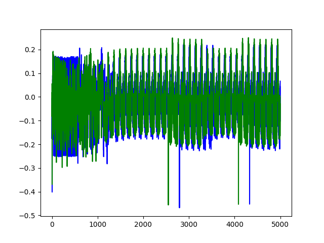
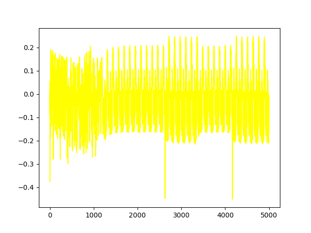
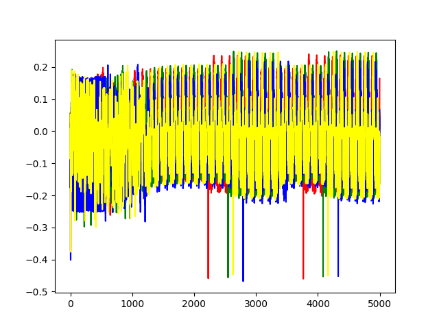

## Lab 2-1A
The main learning outcomes of this lab is that we should be able to
1. Capture a power trace with Chipwhisperer.
2. Make connections between various simple instructions and power traces.


After setting the `SCOPETYPE` and `PLATFORM` parameters, We will build the firmware using

```python

# for jupyter notebook
SCOPETYPE = 'OPENADC'
PLATFORM='CW308_STM32F3'


%%bash
cd ../../../firmware/mcu
mkdir -p simpleserial-base-lab2 && cp -r simpleserial-base/* $_ # $_ means the last argument of the previous command
cd simpleserial-base-lab2


%%bash -s "$PLATFORM" # The -s option passes arguments to the bash script. Whatever follows -s becomes $1, $2, … inside the Bash script (positional parameters).
cd ../../../firmware/mcu/simpleserial-base-lab2
make PLATFORM=$1 CRYPTO_TARGET=NONE
```

<!-- [nrst](../lab2_1a/lab2_1a.md#scopeionrst) -->
### scope.io.nrst
This `scope.io.nrst` is the hardware reset pin, that resets the target device when pulled low (0v)

Then we define this function

```python
def capture_trace(_ignored=None):
    ktp = cw.ktp.Basic()
    key, text = ktp.next()
    return cw.capture_trace(scope, target, text).wave

```
we have also seen the function `scope.get_last_trace()` which gives us the previously collected trace.
But for that, we have to run the code and then we can get the trace. This `cw.capture_trace(scope, target, text)`
does all of that at once assuming that the 'p' command is used. The definition can be seen in `chipwhisperer/software/chipwhisperer/__init__.py`.

## Collecting various traces

In the `simpleserial-base.c`, we make 4 changes and capture the power in each of the cases and compare.

### Empty Trace.
We remove the `simpleserial_put()` and capture the trace. that looks like this




### Unrolled operations.

Now, we add 20 multiplication operations in between the triggers. Note: make sure 'A' is volatile to skip compiler optimizations

```c
volatile long int A = 0x2BAA;
trigger_high();
    A *= 2;
    A *= 2;
    A *= 2;
    A *= 2;
    A *= 2;
    
    A *= 2;
    A *= 2;
    A *= 2;
    A *= 2;
    A *= 2;

    A *= 2;
    A *= 2;
    A *= 2;
    A *= 2;
    A *= 2;
    
    A *= 2;
    A *= 2;
    A *= 2;
    A *= 2;
    A *= 2;
trigger_low();
```

The captured power trace looks like the figure below




We might not see much difference in the first, but when we plot them on the same figure, we can see



### For Loop Operation

Now, If we use the for loop, the trace looks like this



And combinedly, we can see




### Expensive Operation

For some expensive operation like divide, we can see



all combined, we can see




We would also expect that longer instructions would also consume more power. But as we increase the difficulty, it is actually going lower. That is because, in order to measure current, ChipWhisperer measures voltage drop across a shunt resistor. This means that the power trace is actually inverted (aka large negative swings are areas of higher power consumption)
