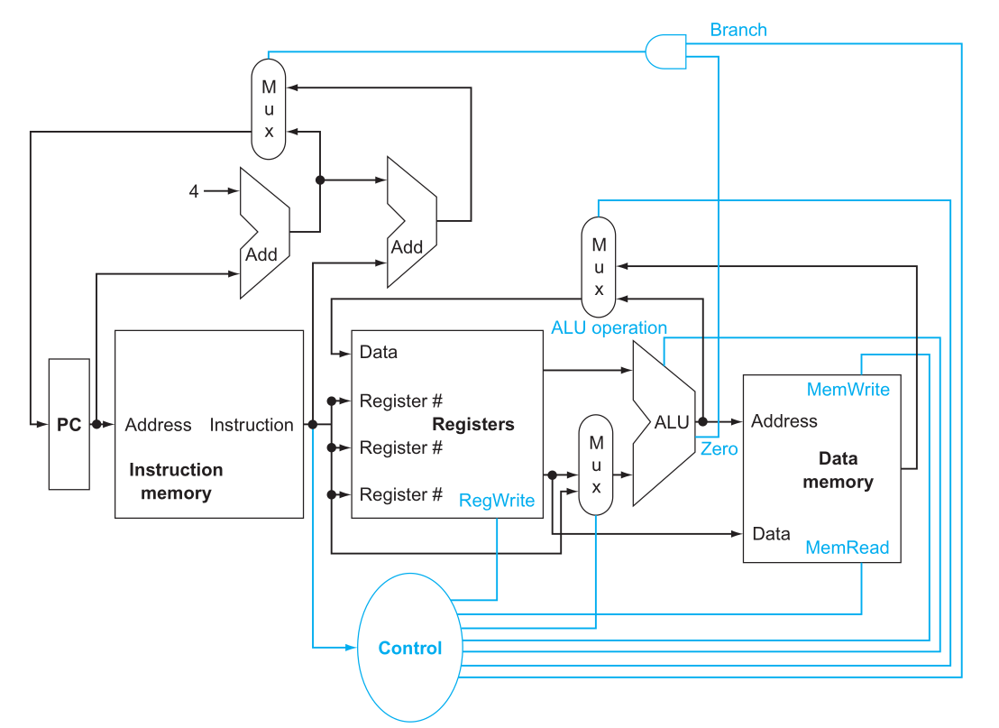

# The Processor: Datapath and Control Path
[back](../coa.md)
<!-- #### 1. Single-cycle datapath: what a CPU must do each instruction

- Know: PC → fetch → decode → reg read → ALU → (optional) memory → write-back.
- Be able to: point to where R-type, I-type, load, store, and branch differ on the path.
- Control: know the role of main control vs. ALU control; why muxes exist.
- 1-minute self-test: For lw rt, 4(rs), list the five steps and say what gets written back.

#### 2. From single-cycle to pipeline (5 stages)

- Know: IF, ID, EX, MEM, WB; pipeline registers between stages.
- Be able to: map each instruction’s work across stages (which stage does what).
- Why: pipelining improves throughput (not single-instruction latency).
- 1-minute self-test: Place add, lw, sw, beq into the 5 stages correctly.

#### 3. Data hazards: forwarding vs. stalling

- Know: RAW hazards; when values are available (EX/MEM/WB timing).
- Be able to: draw/identify forwarding paths; detect when forwarding can’t help.
- Golden rule: load-use needs exactly 1 bubble (stall) in classic 5-stage.
- 1-minute self-test: For lw r1,0(r2); add r3,r1,r4, say if you forward or stall (and from where).

#### 4. Hazard detection & forwarding units (the “brains” that fix hazards)

- Know: what the Forwarding Unit compares (EX.rs/rt vs. later dests) and selects.
- Know: what the Hazard Detection Unit watches (ID stage load-use) to insert a bubble.
- Be able to: state which pipeline reg gets frozen and which control signals become NOP.
- 1-minute self-test: Name the two comparisons that trigger forwarding into ALU inputs A and B.

#### 5. Control hazards (branches/jumps)

- Know: why the fetch path is wrong on a taken branch; what gets flushed.
- Options: compute branch in EX (simplest) → 2-cycle penalty; move earlier or predict to cut penalty.
- Be able to: mark which stages’ instructions are flushed on a taken branch in a 5-stage.
- 1-minute self-test: With branch resolved in EX, how many younger instructions do you flush?

#### 6. Precise exceptions in a pipeline

- Know: precise = all older instructions complete, no younger ones do; EPC records faulting PC.
- Be able to: name the extra paths/state (cause, EPC) and the “poison/flush” idea for younger instrs.
- 1-minute self-test: Explain how a MEM-stage fault is made precise in a 5-stage pipeline.

#### 7. Performance intuition (CPI with stalls)

- Know: ideal CPI≈1 for a full pipeline; real CPI = 1 + (stalls from data + control + structural).
- Be able to: compute CPI given a branch frequency and penalty or a load-use frequency.
- 1-minute self-test: If 20% branches with 2-cycle penalty, what’s CPI (ignoring others)?

#### 8. Beyond the basic pipe (just the vibe)

- Know (names only): multiple-issue (superscalar), speculation, OoO—“more of the same ideas, wider/deeper.”
- 1-minute self-test: In one line, say how forwarding generalizes in a superscalar core. -->

## Introduction

Performance can be determined through:
1. **Instruction count**: depends on compiler and ISA
2. **Clock cycle time**: depends on the implementation of the processor
3. **Cycles per Instruction**: depends on the implementation of the processor

By the end of this chapter, we learn

- to Design a Datapath and a simple processor that can implement MIPS instructions.
- Pipeline implementation of MIPS. 
- Concepts necessary to implement complex instructions like that of x86.

A basic MIPS implementation consisting of core instructions like the *memory-reference* instructions load word (`lw`) and store word (`sw`), the *arithmetic-logical* instructions `add`, `sub`, `AND`, `OR`, and `slt`, the instructions *branch equal* (`beq`) and *jump* (`j`) are used. 

- All instructions start by using the program counter to supply the instruction address to the instruction memory. 
- After the instruction is fetched, the register operands used by an instruction are specified by fields of that instruction. 
- Once the register operands have been fetched, they can be operated on     
    - to compute a memory address (for a load or store). The ALU result is used as an address to either store a value from the registers (`sw`) or load a value from memory into the registers (`lw`).
    - to compute an arithmetic result (for an integer arithmetic-logical instruction). the result from the ALU must be written to a register in this case.
    - or a compare (for a branch).Branches require the use of the ALU output to determine the next instruction address, which comes either from the ALU (where the PC and branch offset are summed) or from an adder that increments the current PC by 4. 
- The thick lines interconnecting the functional units represent buses,
which consist of multiple signals. The arrows are used to guide the reader in knowing how information flows.
- Since signal lines may cross, we explicitly show when crossing lines are connected by the presence of a dot
where the lines cross.
- The top multiplexor (“Mux”) controls what value replaces the PC (PC + 4 or the branch destination address); the multiplexor is controlled
by the gate that “ANDs” together the Zero output of the ALU and a control signal that indicates that the instruction is a branch. 
- The middle
multiplexor, whose output returns to the register file, is used to steer the output of the ALU (in the case of an arithmetic-logical instruction) or
the output of the data memory (in the case of a load) for writing into the register file. 
- Finally, the bottommost multiplexor is used to determine
whether the second ALU input is from the registers (for an arithmetic-logical instruction or a branch) or from the offset field of the instruction
(for a load or store). 
- The added control lines are straightforward and determine the operation performed at the ALU, whether the data memory
should read or write, and whether the registers should perform a write operation. The control lines are shown in color to make them easier to
see.

## Logic Design Conventions
## Building a Datapath
## A Simple Implementation Scheme
## An Overview of Pipelining
## Pipelined Datapath and Control
## Data Hazards: Forwarding versus Stalling
## Control Hazards
## Exceptions
## Parallelism via Instructions
## Real Stuff: The ARM Cortex-A8 and Intel Core i7 Pipelines
## Going Faster: Instruction-Level Parallelism and Matrix Multiply
## Advanced Topic: An Introduction to Digital Design Using a Hardware Design Language to Describe and Model a Pipeline and More Pipelining Illustrations
## Fallacies and Pitfalls
## Concluding Remarks
## Historical Perspective and Further Reading
## Exercises